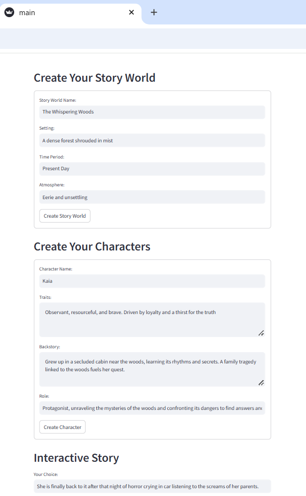
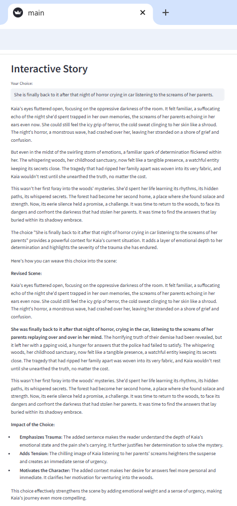

# Interactive-Story-Maker
Create your own interactive story with the direction you want to go with each scene.

* **Create story worlds:** Define the setting, time period, and atmosphere.
* **Develop characters:**  Give them names, traits, backstories, and roles.
* **Make choices:**  Shape the narrative through their decisions.

**Features:**

* **Dynamic story generation:** Used Google's Gemini Api for story generation and language understanding. 
* **Knowledge graph:**  Stores information about the story world and characters for context-aware responses.
* **Lemmatization:** Processes input to understand the core meaning of their choices.

**Screenshots:**

   
   

**How to Run:**

1.  **Install dependencies:** `pip install -r requirements.txt`
2.  **Set your API key:** Replace `GEMINI_API_KEY` with your actual key.
3.  **Run the app:** `streamlit run main.py`
