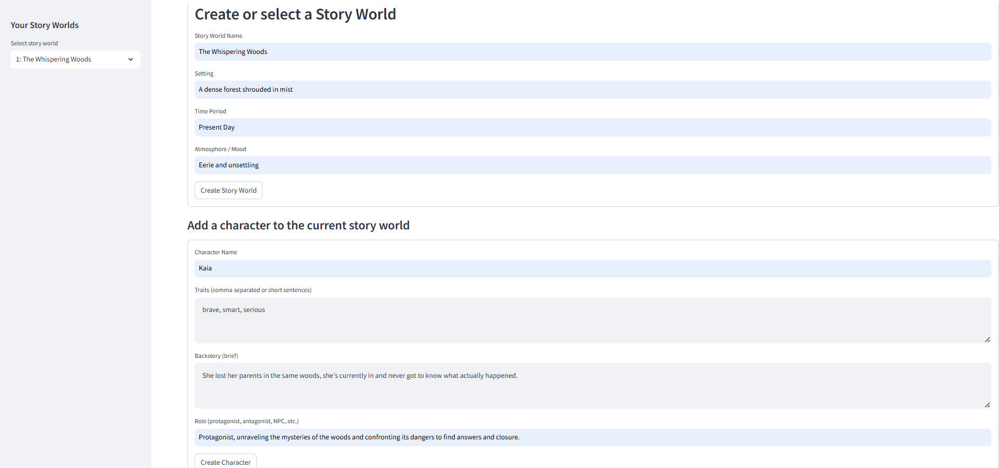
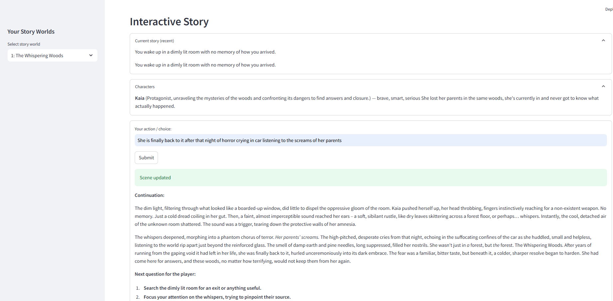

# Interactive Story Maker (RAG + Gemini Flash)

An AI-powered interactive storytelling application where you create worlds, define characters, make choices, and watch your narrative unfold using Retrieval-Augmented Generation (RAG) and Google Gemini 2.5 Flash.

## Features

### Story Worlds

* Define the world name, setting, time period, and atmosphere.
* All world data is embedded and stored in ChromaDB for retrieval.

### Characters

* Add characters with traits, backstories, and roles.
* Each character profile is stored as vector memory to maintain continuity.

### Persistent Memory (RAG)

The application stores and retrieves the following using vector search to ensure consistent storytelling and continuity:

* World metadata
* Character profiles
* Previous scenes
* User choices

### RAG-Based Storytelling

Gemini 2.5 Flash, combined with the retrieved memories, intelligently generates:

* Story continuations
* Follow-up questions
* Context-aware responses

### Choice-Driven Narrative

Every user input is embedded, saved, and directly influences future story decisions, creating a truly unique and branching narrative path.

## Screenshots

<p align="center">
  
  
</p>

## Installation

1.  **Create and activate a virtual environment:**

    ```bash
    python -m venv myenv
    source myenv/Scripts/activate  # Use 'source myenv/bin/activate' on Linux/macOS
    ```

2.  **Install dependencies:**

    ```bash
    pip install -r requirements.txt
    ```

3.  **Set your Gemini API key:**

    ```bash
    export GEMINI_API_KEY="your_api_key_here"
    ```

4.  **Run the application:**

    ```bash
    streamlit run main.py
    ```

## Tech Used

* **Model:** `google/gemini-2.5-flash`
* **Vector Database:** ChromaDB (for vector memory)
* **Embedding Model:** SentenceTransformers (`all-mpnet-base-v2`)
* **Frameworks:** LangChain, Streamlit
